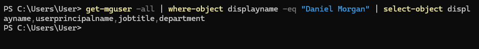
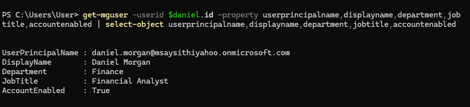
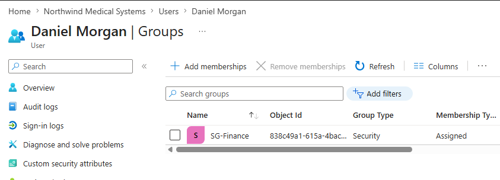
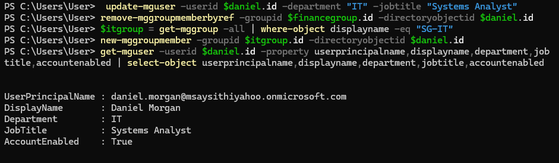
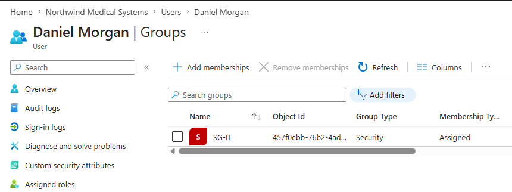
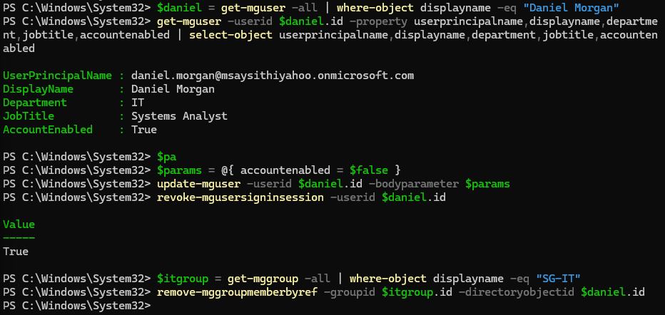
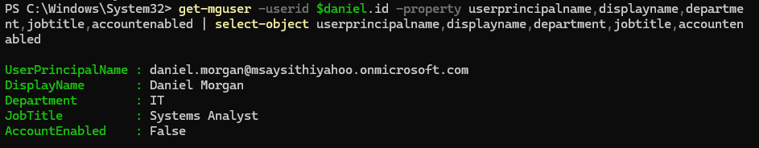
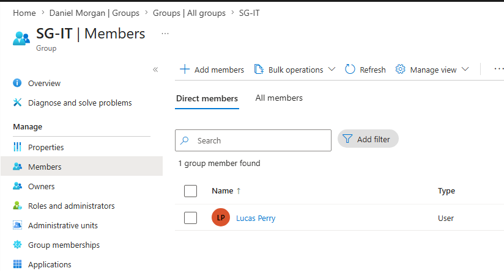

<h1>Microsoft Entra ID - Identity Lifecycle Management (JML)</h1>

In this lab, I performed Joiner, Mover, and Leaver (JML) identity lifecycle tasks in Microsoft Entra ID. I provisioned a new user, assigned role-based group access, modified access after a department transfer, and deprovisioned the account after termination. Microsoft Graph PowerShell was used to perform and verify identity and access changes throughout the lab.  

<h2>Environments and Technologies Used</h2>

- Microsoft Entra ID
- Microsoft Graph PowerShell
- PowerShell
- Microsoft Entra Security Groups

<h2>IAM Concepts Demonstrated</h2>

- Identity Lifecycle Management
- Joiner, Mover, Leaver (JML)
- User Provisioning and Deprovisioning
- Role-Based Access Control (RBAC)
- Group-Based Access Management
- Least Privilege
- Access Revocation
- Session Revocation

<h2>High-Level Steps</h2>

- Step 1. Joiner - Provision a new Finance employee
- Step 2. Mover - Transfer the employee from Finance to IT
- Step 3. Leaver - Disable the account and remove access

<h2>Actions and Observations</h2>

<b>1. JOINER - USER PROVISIONING</b>

A request was received to provision a new Finance employee, Daniel Morgan, with the job title Financial Analyst. Before creating the account, I searched Microsoft Entra ID using Microsoft Graph PowerShell to verify that an existing identity for Daniel Morgan was not already present.

After confirming that the user did not exist, I provisioned the new account and configured the required identity attributes. Daniel was then assigned to the SG-Finance security group to provide access appropriate for his Finance role.

The account was verified after provisioning to confirm the correct user principal name, department, job title, and account status.

Group membership was also verified in Microsoft Entra ID to confirm that Daniel was successfully assigned to SG-Finance.

> [!NOTE]
> Group-based access allows permissions to be managed according to a user's role rather than assigning access individually. This supports RBAC and simplifies access management throughout the identity lifecycle.

<b>2. MOVER - ROLE AND ACCESS CHANGE</b>

Daniel Morgan was transferred from Finance to IT with a new job title of Systems Analyst. His existing identity and access were reviewed before processing the change.

I updated Daniel's department and job title, removed his previous SG-Finance membership, and assigned him to SG-IT. Removing the previous Finance access prevents unnecessary access from accumulating as users move between roles.

After completing the changes, I verified the updated identity attributes using Microsoft Graph PowerShell.

The resulting group membership was verified in Microsoft Entra ID to confirm that SG-Finance had been removed and SG-IT was assigned.

> [!NOTE]
> Removing access associated with a user's previous role helps enforce least privilege and reduces access accumulation during the Mover process.

<b>3. LEAVER - ACCOUNT DEPROVISIONING</b>

A termination request was received for Daniel Morgan. The account was reviewed before beginning the deprovisioning process.

I disabled the Entra ID account, revoked active sign-in sessions, and removed Daniel's SG-IT group membership. The account was retained rather than deleted to represent an organization where account deletion occurs later according to retention policy.

After completing the deprovisioning actions, I verified that the account was disabled.

Finally, I verified the user's group memberships in Microsoft Entra ID to confirm that SG-IT access had been removed.

> [!IMPORTANT]
> Disabling the identity, revoking active sessions, and removing access helps prevent a terminated user from continuing to access organizational resources while allowing the identity to be retained according to organizational retention requirements.

<h2>Lab Summary</h2>

This lab demonstrated the complete Joiner, Mover, and Leaver identity lifecycle in Microsoft Entra ID. I used Microsoft Graph PowerShell and the Entra admin center to provision an identity, manage role-based group access, modify access after a role change, revoke sessions, and deprovision the account.

The lab reinforced how identity lifecycle management, RBAC, least privilege, and timely access revocation work together to ensure users have the appropriate access throughout their employment lifecycle.
